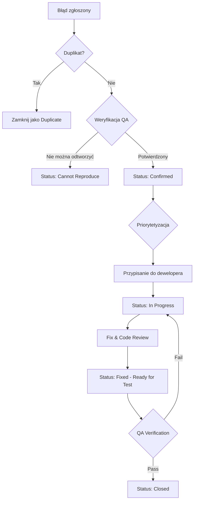

# Plan Testów - KanbanLite MVP

## 1. Wprowadzenie i Cele Testowania

### 1.1 Cel dokumentu
Niniejszy dokument przedstawia kompleksowy plan testów dla aplikacji KanbanLite MVP - systemu zarządzania produkcją kartek świątecznych opartego na metodologii Kanban.

### 1.2 Cele testowania
- Weryfikacja poprawności funkcjonalności biznesowej systemu produkcyjnego
- Zapewnienie prawidłowego działania autoryzacji opartej na rolach (RBAC)
- Walidacja integralności danych w bazie PostgreSQL
- Potwierdzenie zgodności z założeniami architektonicznymi (.NET 8, Blazor Server, EF Core)
- Weryfikacja ścieżek krytycznych związanych z zarządzaniem zleceniami i statusami produkcji
- Zapewnienie jakości audytu zmian i śledzenia historii operacji

### 1.3 Zakres zastosowania
Plan testów dotyczy wszystkich warstw aplikacji:
- Warstwa prezentacji (Blazor Server + MudBlazor)
- Warstwa aplikacji (serwisy biznesowe)
- Warstwa dostępu do danych (EF Core + PostgreSQL)
- Moduł autoryzacji (ASP.NET Core Identity)

## 2. Zakres Testów

### 2.1 Funkcjonalności objęte testami

#### 2.1.1 Moduł zarządzania zleceniami (Orders)
- Tworzenie nowego zlecenia przez Managera
- Walidacja danych wejściowych (numer zlecenia, ilość, format produktu, termin)
- Automatyczne tworzenie projektu i podziału na batche zgodnie z regułami podziału
- Weryfikacja integralności transakcyjnej przy tworzeniu zlecenia

#### 2.1.2 Moduł zarządzania projektami (Projects)
- Generowanie numeru projektu na podstawie numeru zlecenia
- Zarządzanie statusem projektu (aktywny/zakończony)
- Relacje między zleceniem, projektem i batchami

#### 2.1.3 Moduł Kanban - zarządzanie batchami
- Wyświetlanie listy batchy z filtrowaniem (status, etap, wyszukiwanie)
- Stronicowanie i sortowanie wyników
- Aktualizacja statusu batcha (New, InProgress, Done)
- Aktualizacja etapu produkcyjnego (Design, Print, Cut, Pack, Ship)
- Walidacja reguł biznesowych (np. soft limit 20 batchy InProgress)
- Obliczanie procentowego postępu na podstawie etapu

#### 2.1.4 System audytu i historii zmian
- Automatyczne logowanie zmian statusu i etapu batcha
- Zapisywanie informacji o użytkowniku wykonującym zmianę
- Zachowanie historii zmian (old/new values)
- Stronicowanie historii audytu

#### 2.1.5 Dashboard Managera
- Agregacja statystyk według statusów batchy
- Agregacja statystyk według etapów produkcyjnych
- Lista pilnych zleceń (termin < 7 dni)
- Ostrzeżenia systemowe (np. przekroczenie soft limitów)

#### 2.1.6 Zarządzanie formatami produktów
- CRUD formatów produktów
- Zarządzanie statusem aktywności formatu
- Walidacja unikalności nazw formatów

#### 2.1.7 Zarządzanie regułami podziału batchy
- Konfiguracja reguł podziału według ilości
- Weryfikacja zastosowania właściwej reguły przy tworzeniu zlecenia
- Walidacja przedziałów ilościowych

#### 2.1.8 Autoryzacja i uwierzytelnianie
- Logowanie użytkowników (Manager/Operator)
- Weryfikacja uprawnień dostępu do funkcjonalności według roli
- Blokowanie dostępu do Dashboard i tworzenia zleceń dla Operatora
- Dostęp do Kanbana dla obu ról
- Obsługa przekierowań dla nieautoryzowanych żądań

### 2.2 Funkcjonalności wyłączone z zakresu testów
- Zaawansowane funkcje raportowania (poza zakresem MVP)
- Eksport danych do plików
- Integracje z systemami zewnętrznymi
- Rozbudowane funkcje wyszukiwania pełnotekstowego
- Wielojęzyczność interfejsu (MVP w języku polskim)

### 2.3 Dane testowe
- Użytkownicy: `menago/menago` (Manager), `operator/operator` (Operator)
- Formaty produktów: minimum 3 aktywne formaty
- Reguły podziału batchy: minimum 3 reguły pokrywające różne zakresy ilościowe
- Zlecenia testowe: pokrywające różne scenariusze ilościowe i terminowe

## 3. Typy Testów do Przeprowadzenia

### 3.1 Testy jednostkowe (Unit Tests)

#### 3.1.1 Zakres
- Serwisy warstwy Application (BatchService, OrderService, ProjectService, DashboardService, itp.)
- Logika autoryzacji (AuthorizationHelper)
- Walidacje biznesowe
- Konwertery i helpery

#### 3.1.2 Technologie
- xUnit.net (framework testowy)
- Moq (biblioteka do mockowania)
- FluentAssertions (asercje)

#### 3.1.3 Metryki
- Cel: minimum 80% pokrycia kodu warstwy Application
- Priorytet: ścieżki krytyczne 100% pokrycia

#### 3.1.4 Przykładowe scenariusze
```csharp
// BatchService
- GetKanbanAsync_WithValidQuery_ReturnsFilteredResults
- GetKanbanAsync_WithNullQuery_ReturnsValidationError
- GetKanbanAsync_UnauthorizedUser_ReturnsUnauthorizedError
- GetKanbanAsync_WithStatusFilter_ReturnsOnlyMatchingBatches
- GetKanbanAsync_WithStageFilter_ReturnsOnlyMatchingStages
- GetKanbanAsync_WithSearchQuery_FiltersOrderAndProjectNumbers
- GetKanbanAsync_SortByDueDateAsc_ReturnsSortedResults

// OrderService
- CreateAsync_WithValidRequest_CreatesOrderProjectAndBatches
- CreateAsync_WithoutManagerRole_ReturnsForbiddenError
- CreateAsync_WithInvalidProductFormat_ReturnsValidationError
- CreateAsync_WithInactiveProductFormat_ReturnsValidationError
- CreateAsync_WithoutMatchingSplitRule_ReturnsValidationError
- CreateAsync_WithValidData_CreatesCorrectNumberOfBatches
- CreateAsync_TransactionRollback_OnFailure

// AuthorizationHelper
- EnsureManagerAuthorized_WithManagerRole_ReturnsNull
- EnsureManagerAuthorized_WithOperatorRole_ReturnsForbiddenError
- EnsureManagerAuthorized_WithoutAuthentication_ReturnsUnauthorizedError
- EnsureManagerOrOperatorAuthorized_WithEitherRole_ReturnsNull

// DashboardService
- GetAsync_WithManagerRole_ReturnsAggregatedStatistics
- GetAsync_WithOperatorRole_ReturnsForbiddenError
- GetAsync_WithInProgressExceedingSoftLimit_ReturnsWarning
- GetAsync_FiltersByActiveProjectsOnly
```

### 3.2 Testy integracyjne (Integration Tests)

#### 3.2.1 Zakres
- Integracja warstwy Application z DataAccess
- Operacje na rzeczywistej bazie danych (TestContainers + PostgreSQL)
- Weryfikacja migracji EF Core
- Testy end-to-end serwisów z DbContext

#### 3.2.2 Technologie
- xUnit.net
- Testcontainers.PostgreSQL (konteneryzowana baza testowa)
- Microsoft.AspNetCore.Mvc.Testing (WebApplicationFactory)
- Respawn (czyszczenie bazy między testami)

#### 3.2.3 Infrastruktura testowa
```csharp
public class IntegrationTestBase : IAsyncLifetime
{
    private PostgreSqlContainer _postgres;
    protected AppDbContext DbContext;
    
    public async Task InitializeAsync()
    {
        _postgres = new PostgreSqlBuilder()
            .WithImage("postgres:16")
            .Build();
        await _postgres.StartAsync();
        
        var options = new DbContextOptionsBuilder<AppDbContext>()
            .UseNpgsql(_postgres.GetConnectionString())
            .Options;
            
        DbContext = new AppDbContext(options);
        await DbContext.Database.MigrateAsync();
    }
}
```

#### 3.2.4 Przykładowe scenariusze
```csharp
// Order Creation Integration
- CreateOrder_E2E_CreatesAllEntitiesInDatabase
- CreateOrder_WithTransaction_RollsBackOnError
- CreateOrder_CreatesAuditLogForBatches

// Batch Update Integration
- UpdateBatchStatus_CreatesAuditLogEntry
- UpdateBatchStage_UpdatesTimestamps
- UpdateBatch_ConcurrentModification_HandledCorrectly

// Dashboard Integration
- Dashboard_AggregatesRealDatabaseData
- Dashboard_FiltersActiveProjectsOnly
- Dashboard_UrgentOrders_QueriesCorrectly

// Authorization Integration
- AuthenticatedRequest_WithCorrectRole_ExecutesSuccessfully
- AuthenticatedRequest_WithWrongRole_ReturnsError
```

### 3.3 Testy interfejsu użytkownika (UI Tests)

#### 3.3.1 Zakres
- Komponenty Blazor (.razor)
- Interakcje użytkownika
- Renderowanie warunkowe
- Wiązania danych (data binding)

#### 3.3.2 Technologie
- bUnit (biblioteka do testowania komponentów Blazor)
- AngleSharp (parsowanie HTML)

#### 3.3.3 Przykładowe scenariusze
```csharp
// Kanban Table Component
- KanbanTable_RendersCorrectly_WithEmptyData
- KanbanTable_DisplaysBatches_WithData
- KanbanTable_StatusFilter_UpdatesResults
- KanbanTable_StageFilter_UpdatesResults
- KanbanTable_SearchBox_FiltersResults
- KanbanTable_Pagination_WorksCorrectly

// Dashboard Component (Manager only)
- Dashboard_RendersStatistics_ForManager
- Dashboard_ShowsWarning_WhenSoftLimitExceeded
- Dashboard_DisplaysUrgentOrders

// Login Component
- Login_WithValidCredentials_RedirectsToHome
- Login_WithInvalidCredentials_ShowsError
- Login_EmptyFields_ShowsValidation

// Product Format Dialog
- ProductFormatDialog_Create_SavesSuccessfully
- ProductFormatDialog_Edit_UpdatesExisting
- ProductFormatDialog_Validation_ShowsErrors
```

### 3.4 Testy wydajnościowe (Performance Tests)

#### 3.4.1 Zakres
- Wydajność zapytań Kanban z dużą ilością batchy
- Czas odpowiedzi Dashboard z agregacjami
- Wydajność operacji tworzenia zlecenia z wieloma batchami
- Testy obciążeniowe dla scenariuszy współbieżnych

#### 3.4.2 Technologie
- BenchmarkDotNet (microbenchmarking)
- NBomber lub JMeter (testy obciążeniowe)

#### 3.4.3 Kryteria wydajnościowe
- Kanban: odpowiedź < 500ms dla 1000 batchy
- Dashboard: odpowiedź < 300ms
- Tworzenie zlecenia: < 2s dla zlecenia z 20 batchami
- Operacje pojedyncze (update status/stage): < 100ms

#### 3.4.4 Scenariusze testowe
- Kanban pagination z 10,000 rekordów
- Dashboard aggregations z 5,000 batchy
- Współbieżne aktualizacje statusu batcha (10 użytkowników)
- Tworzenie wielu zleceń równolegle (5 Managerów)

### 3.5 Testy bezpieczeństwa (Security Tests)

#### 3.5.1 Zakres
- Weryfikacja autoryzacji na poziomie kontrolerów i serwisów
- Testy obejścia uwierzytelniania
- Walidacja CSRF protection (dla endpoint'ów HTTP)
- SQL Injection prevention (EF Core parametrization)
- XSS prevention (Blazor auto-encoding)

#### 3.5.2 Scenariusze testowe
```
- Próba dostępu do Dashboard jako Operator (oczekiwane: Forbidden)
- Próba tworzenia zlecenia jako Operator (oczekiwane: Forbidden)
- Próba aktualizacji batcha bez uwierzytelnienia (oczekiwane: Unauthorized)
- Próba dostępu do audytu batcha innego projektu (oczekiwane: dane widoczne - brak izolacji na MVP)
- Walidacja długości inputów (zapobieganie buffer overflow)
- Test parametryzacji zapytań SQL (brak podatności SQL Injection)
```

### 3.6 Testy regresji (Regression Tests)

#### 3.6.1 Zakres
- Podzbiór krytycznych testów automatycznych uruchamiany po każdej zmianie
- Weryfikacja, że nowe funkcjonalności nie psują istniejących

#### 3.6.2 Scenariusze
- Smoke tests: podstawowe ścieżki (login, Kanban, tworzenie zlecenia)
- Regresja kluczowych przypadków (audyt, autoryzacja, tworzenie batchy)

### 3.7 Testy akceptacyjne użytkownika (UAT)

#### 3.7.1 Zakres
- Manualne testy wykonywane przez product ownera lub klienta końcowego
- Weryfikacja zgodności z wymaganiami biznesowymi
- Użyteczność interfejsu

#### 3.7.2 Scenariusze
- Manager: pełny workflow od utworzenia zlecenia do wysłania
- Operator: workflow aktualizacji statusów i etapów na Kanbanie
- Weryfikacja czytelności Dashboard i metryk
- Sprawdzenie historii audytu zmian

## 4. Scenariusze Testowe dla Kluczowych Funkcjonalności

### 4.1 Tworzenie zlecenia (Order Creation) - E2E

**Priorytet:** Krytyczny  
**Rola:** Manager

| Krok | Akcja | Oczekiwany rezultat |
|------|-------|---------------------|
| 1 | Zaloguj się jako `menago/menago` | Przekierowanie do strony głównej |
| 2 | Przejdź do "Panel Managera" → "Utwórz Zlecenie" | Formularz tworzenia zlecenia wyświetlony |
| 3 | Wprowadź dane: OrderNumber=`ORD-2026-001`, Quantity=`150`, ProductFormat=`Kartka A5`, DueDate=`2026-02-15` | Dane wprowadzone poprawnie |
| 4 | Kliknij "Zapisz" | Zlecenie utworzone, projekt wygenerowany, batche podzielone zgodnie z regułą |
| 5 | Przejdź do Kanban | Widoczne nowe batche dla projektu `PRJ-ORD-2026-001` |
| 6 | Sprawdź szczegóły pierwszego batcha | Batch #1, Quantity zgodna z regułą, Status=New, Stage=Design |

**Warunki wstępne:**
- Aktywny format produktu "Kartka A5" istnieje
- Aktywna reguła podziału dla Quantity=150 istnieje

**Dane testowe:**
- OrderNumber: ORD-2026-001
- Quantity: 150 sztuk
- DueDate: 2026-02-15

### 4.2 Aktualizacja statusu batcha na Kanbanie

**Priorytet:** Krytyczny  
**Rola:** Operator lub Manager

| Krok | Akcja | Oczekiwany rezultat |
|------|-------|---------------------|
| 1 | Zaloguj się jako `operator/operator` | Przekierowanie do strony głównej |
| 2 | Przejdź do "Kanban" | Lista batchy wyświetlona |
| 3 | Znajdź batch ze statusem "New" | Batch widoczny w tabeli |
| 4 | Zmień status na "InProgress" | Status zaktualizowany, UpdatedAt odświeżony |
| 5 | Sprawdź licznik InProgress na górze strony | Licznik zwiększony o 1 |
| 6 | Przejdź do szczegółów batcha → "Historia zmian" | Wpis audytu z OldStatus=New, NewStatus=InProgress, ChangedByUserId=operator |

**Warunki wstępne:**
- Istnieje minimum jeden batch ze statusem "New"

### 4.3 Aktualizacja etapu produkcyjnego

**Priorytet:** Wysoki  
**Rola:** Operator lub Manager

| Krok | Akcja | Oczekiwany rezultat |
|------|-------|---------------------|
| 1 | Zaloguj się jako `operator/operator` | Przekierowanie do strony głównej |
| 2 | Przejdź do "Kanban" | Lista batchy wyświetlona |
| 3 | Znajdź batch z etapem "Design" | Batch widoczny |
| 4 | Zmień etap na "Print" | Etap zaktualizowany, progress % zwiększony |
| 5 | Zmień etap na "Cut" | Etap zaktualizowany, progress % = 60% |
| 6 | Zmień etap na "Pack" | Etap zaktualizowany, progress % = 80% |
| 7 | Zmień etap na "Ship" | Etap zaktualizowany, progress % = 100% |
| 8 | Sprawdź historię zmian | Wszystkie zmiany etapów zalogowane z prawidłowymi wartościami old/new |

### 4.4 Weryfikacja Dashboard Managera

**Priorytet:** Wysoki  
**Rola:** Manager

| Krok | Akcja | Oczekiwany rezultat |
|------|-------|---------------------|
| 1 | Zaloguj się jako `menago/menago` | Przekierowanie do strony głównej |
| 2 | Przejdź do "Panel Managera" → "Dashboard" | Dashboard wyświetlony |
| 3 | Sprawdź sekcję "Status batchy" | Wyświetlone liczby: New, InProgress, Done |
| 4 | Sprawdź sekcję "Etapy produkcji" | Wyświetlone liczby dla: Design, Print, Cut, Pack, Ship |
| 5 | Sprawdź sekcję "Pilne zlecenia" | Lista zleceń z terminem < 7 dni |
| 6 | Sprawdź sekcję "Ostrzeżenia" | Jeśli InProgress > 20, wyświetlone ostrzeżenie |

**Dane testowe:**
- Przygotuj zlecenie z terminem za 3 dni
- Ustaw 22 batche na status InProgress (test soft limit)

### 4.5 Filtrowanie i wyszukiwanie na Kanbanie

**Priorytet:** Średni  
**Rola:** Operator lub Manager

| Krok | Akcja | Oczekiwany rezultat |
|------|-------|---------------------|
| 1 | Zaloguj się jako `operator/operator` | Przekierowanie do strony głównej |
| 2 | Przejdź do "Kanban" | Lista wszystkich batchy wyświetlona |
| 3 | Filtruj po Status=InProgress | Wyświetlone tylko batche ze statusem InProgress |
| 4 | Usuń filtr statusu | Wszystkie batche ponownie widoczne |
| 5 | Filtruj po Stage=Print | Wyświetlone tylko batche z etapem Print |
| 6 | Wprowadź frazę w wyszukiwarkę: `ORD-2026` | Wyświetlone tylko batche dla zleceń zawierających "ORD-2026" |
| 7 | Wyczyść wyszukiwarkę i filtry | Wszystkie batche ponownie widoczne |

### 4.6 Autoryzacja - blokada dostępu Operatora do Dashboard

**Priorytet:** Krytyczny  
**Rola:** Operator

| Krok | Akcja | Oczekiwany rezultat |
|------|-------|---------------------|
| 1 | Zaloguj się jako `operator/operator` | Przekierowanie do strony głównej |
| 2 | Spróbuj przejść bezpośrednio do `/manager/dashboard` | Przekierowanie do strony błędu lub komunikat "Forbidden" |
| 3 | Spróbuj przejść do `/manager/create-order` | Przekierowanie do strony błędu lub komunikat "Forbidden" |
| 4 | Przejdź do "Kanban" | Dostęp przyznany, lista batchy widoczna |

### 4.7 Stronicowanie wyników Kanban

**Priorytet:** Średni  
**Rola:** Operator lub Manager

| Krok | Akcja | Oczekiwany rezultat |
|------|-------|---------------------|
| 1 | Przygotuj środowisko z 150 batchami | 150 batchy w bazie danych |
| 2 | Zaloguj się i przejdź do "Kanban" | Pierwsza strona (50 batchy) wyświetlona |
| 3 | Sprawdź paginację na dole strony | Wyświetlone przyciski: 1, 2, 3 |
| 4 | Kliknij "Strona 2" | Wyświetlone batche 51-100 |
| 5 | Kliknij "Strona 3" | Wyświetlone batche 101-150 |
| 6 | Kliknij "Strona 1" | Powrót do pierwszej strony |

### 4.8 Historia audytu zmian batcha

**Priorytet:** Wysoki  
**Rola:** Manager lub Operator

| Krok | Akcja | Oczekiwany rezultat |
|------|-------|---------------------|
| 1 | Zaloguj się jako `operator/operator` | Przekierowanie do strony głównej |
| 2 | Przejdź do Kanban, wybierz batch | Widok szczegółów batcha |
| 3 | Zmień status z "New" na "InProgress" | Status zaktualizowany |
| 4 | Zmień etap z "Design" na "Print" | Etap zaktualizowany |
| 5 | Zaloguj się jako `menago/menago` | Logowanie zakończone sukcesem |
| 6 | Przejdź do tego samego batcha | Widok szczegółów batcha |
| 7 | Zmień etap z "Print" na "Cut" | Etap zaktualizowany |
| 8 | Wyświetl historię zmian | 3 wpisy audytu widoczne: <br>1. operator: Status New→InProgress<br>2. operator: Stage Design→Print<br>3. menago: Stage Print→Cut |

### 4.9 Zarządzanie formatami produktów

**Priorytet:** Średni  
**Rola:** Manager

| Krok | Akcja | Oczekiwany rezultat |
|------|-------|---------------------|
| 1 | Zaloguj się jako `menago/menago` | Logowanie zakończone sukcesem |
| 2 | Przejdź do "Panel Managera" → "Formaty produktów" | Lista formatów wyświetlona |
| 3 | Kliknij "Dodaj format" | Dialog tworzenia formatu otwarty |
| 4 | Wprowadź nazwę: "Kartka A6", IsActive=true | Dane wprowadzone |
| 5 | Kliknij "Zapisz" | Format utworzony, widoczny na liście |
| 6 | Edytuj format: zmień IsActive na false | Format dezaktywowany |
| 7 | Spróbuj utworzyć zlecenie z tym formatem | Walidacja błędu: "Format nieaktywny" |

### 4.10 Zarządzanie regułami podziału batchy

**Priorytet:** Średni  
**Rola:** Manager

| Krok | Akcja | Oczekiwany rezultat |
|------|-------|---------------------|
| 1 | Zaloguj się jako `menago/menago` | Logowanie zakończone sukcesem |
| 2 | Przejdź do "Panel Managera" → "Reguły podziału" | Lista reguł wyświetlona |
| 3 | Kliknij "Dodaj regułę" | Dialog tworzenia reguły otwarty |
| 4 | Wprowadź: QuantityMin=1, QuantityMax=50, BatchSize=25 | Dane wprowadzone |
| 5 | Kliknij "Zapisz" | Reguła utworzona, widoczna na liście |
| 6 | Utwórz zlecenie z Quantity=40 | Zlecenie podzielone na 2 batche po 25 i 15 sztuk |

## 5. Środowisko Testowe

### 5.1 Środowiska

#### 5.1.1 Środowisko lokalne (Development)
- **Cel:** Testy podczas developmentu, debugowanie
- **Baza danych:** PostgreSQL 16 lokalnie (Docker Compose)
- **Backend:** .NET 8 SDK (uruchamiany przez `dotnet run`)
- **Frontend:** Blazor Server wbudowany w backend
- **URL:** http://localhost:5145 (lub port z `launchSettings.json`)
- **Migracje:** Stosowane automatycznie przy starcie w Development

#### 5.1.2 Środowisko CI/CD (GitHub Actions)
- **Cel:** Testy automatyczne przy każdym commit/PR
- **Baza danych:** PostgreSQL (Testcontainers w workflow)
- **Runner:** ubuntu-latest
- **Konfiguracja:**
  ```yaml
  - dotnet restore
  - dotnet build --no-restore
  - dotnet test --no-build --verbosity normal
  ```

#### 5.1.3 Środowisko UAT/Staging
- **Cel:** Testy akceptacyjne użytkownika
- **Hosting:** Azure App Service (plan testowy)
- **Baza danych:** Azure Database for PostgreSQL
- **URL:** https://kanbanlite-staging.azurewebsites.net (przykład)
- **Dane:** Dane testowe zbliżone do produkcyjnych

#### 5.1.4 Środowisko produkcyjne
- **Cel:** Wdrożenie finalne (poza zakresem testów)
- **Hosting:** Azure App Service (plan produkcyjny)
- **Baza danych:** Azure Database for PostgreSQL (z backupami)

### 5.2 Konfiguracja bazy danych testowej

#### 5.2.1 Docker Compose dla testów lokalnych
```yaml
services:
  postgres-test:
    image: postgres:16
    environment:
      POSTGRES_DB: kanbanlite_test
      POSTGRES_USER: testuser
      POSTGRES_PASSWORD: testpass
    ports:
      - "5433:5432"
    volumes:
      - postgres_test_data:/var/lib/postgresql/data
```

#### 5.2.2 Connection String testowy
```json
{
  "ConnectionStrings": {
    "KanbanConnectionString": "Host=localhost;Port=5433;Database=kanbanlite_test;Username=testuser;Password=testpass"
  }
}
```

### 5.3 Dane seed dla testów

#### 5.3.1 Użytkownicy testowi
```csharp
// Menago (Manager)
Username: menago
Password: menago
Role: Manager

// Operator (Operator)
Username: operator
Password: operator
Role: Operator
```

#### 5.3.2 Formaty produktów
```
1. Kartka A5 (IsActive=true)
2. Kartka A6 (IsActive=true)
3. Kartka kwadratowa 15x15 (IsActive=true)
4. Kartka A4 (IsActive=false) - do testów walidacji
```

#### 5.3.3 Reguły podziału batchy
```
1. QuantityMin=1,   QuantityMax=50,   BatchSize=25
2. QuantityMin=51,  QuantityMax=100,  BatchSize=50
3. QuantityMin=101, QuantityMax=500,  BatchSize=100
4. QuantityMin=501, QuantityMax=10000, BatchSize=200
```

## 6. Narzędzia do Testowania

### 6.1 Narzędzia do testów jednostkowych i integracyjnych

| Narzędzie | Przeznaczenie | Wersja |
|-----------|--------------|--------|
| **xUnit.net** | Framework testowy dla .NET | 2.6+ |
| **Moq** | Biblioteka do mockowania zależności | 4.20+ |
| **FluentAssertions** | Czytelne asercje | 6.12+ |
| **Testcontainers** | Konteneryzowane bazy danych testowe | 3.7+ |
| **Respawn** | Czyszczenie bazy między testami | 6.2+ |
| **Microsoft.AspNetCore.Mvc.Testing** | Testy integracyjne ASP.NET Core | 8.0+ |
| **Bogus** | Generowanie danych testowych | 35.0+ |

### 6.2 Narzędzia do testów UI

| Narzędzie | Przeznaczenie | Wersja |
|-----------|--------------|--------|
| **bUnit** | Testowanie komponentów Blazor | 1.26+ |
| **AngleSharp** | Parsowanie i analiza HTML | 1.0+ |

### 6.3 Narzędzia do testów wydajnościowych

| Narzędzie | Przeznaczenie | Wersja |
|-----------|--------------|--------|
| **BenchmarkDotNet** | Microbenchmarking | 0.13+ |
| **NBomber** | Testy obciążeniowe i wydajnościowe | 5.0+ (opcjonalnie) |

### 6.4 Narzędzia do analizy kodu

| Narzędzie | Przeznaczenie |
|-----------|--------------|
| **Coverlet** | Pokrycie kodu testami |
| **ReportGenerator** | Generowanie raportów pokrycia |
| **SonarQube** (opcjonalnie) | Analiza jakości kodu |
| **dotnet-format** | Formatowanie kodu |

### 6.5 Narzędzia CI/CD

| Narzędzie | Przeznaczenie |
|-----------|--------------|
| **GitHub Actions** | Automatyczne uruchamianie testów |
| **Azure Pipelines** (opcjonalnie) | Alternatywny pipeline CI/CD |

### 6.6 Narzędzia do testów manualnych

| Narzędzie | Przeznaczenie |
|-----------|--------------|
| **Przeglądarki** | Chrome, Firefox, Edge - testowanie UI |
| **Browser DevTools** | Debugowanie, analiza network, console |
| **Postman** (opcjonalnie) | Testowanie endpoint'ów HTTP/REST |

## 7. Harmonogram Testów

### 7.1 Fazy testowania

| Faza | Czas trwania | Typy testów | Odpowiedzialny |
|------|--------------|-------------|----------------|
| **Faza 1: Testy jednostkowe** | Sprint 1-2 | Unit Tests (warstwa Application) | Deweloperzy |
| **Faza 2: Testy integracyjne** | Sprint 2-3 | Integration Tests (Application + DataAccess) | Deweloperzy + QA |
| **Faza 3: Testy UI** | Sprint 3 | UI Tests (komponenty Blazor) | Deweloperzy + QA |
| **Faza 4: Testy wydajnościowe** | Sprint 4 | Performance Tests | QA + DevOps |
| **Faza 5: Testy bezpieczeństwa** | Sprint 4 | Security Tests | Security Engineer (lub QA) |
| **Faza 6: Testy regresji** | Każdy sprint | Regression Tests | Automatyczne (CI/CD) |
| **Faza 7: UAT** | Przed wdrożeniem | Manualne testy akceptacyjne | Product Owner + Klient |

### 7.2 Harmonogram szczegółowy

#### Sprint 1 (Tydzień 1-2)
- **Tydzień 1:**
  - Przygotowanie infrastruktury testowej (projekty testowe, Testcontainers)
  - Testy jednostkowe dla `OrderService`
  - Testy jednostkowe dla `BatchService`
- **Tydzień 2:**
  - Testy jednostkowe dla `DashboardService`
  - Testy jednostkowe dla `AuthorizationHelper`
  - Testy jednostkowe dla pozostałych serwisów

#### Sprint 2 (Tydzień 3-4)
- **Tydzień 3:**
  - Testy integracyjne dla tworzenia zlecenia (E2E z bazą)
  - Testy integracyjne dla aktualizacji batcha
  - Testy integracyjne dla audytu
- **Tydzień 4:**
  - Testy integracyjne dla Dashboard
  - Testy integracyjne dla autoryzacji
  - Code coverage analysis (minimum 80%)

#### Sprint 3 (Tydzień 5-6)
- **Tydzień 5:**
  - Testy UI dla komponentów Kanban (KanbanTable, filtry, paginacja)
  - Testy UI dla Dashboard
  - Testy UI dla formularzy (CreateOrder, ProductFormat, BatchSplitRule)
- **Tydzień 6:**
  - Testy UI dla Login i autoryzacji
  - Testy UI dla dialogów (ProductFormatDialog, BatchSplitRuleDialog)

#### Sprint 4 (Tydzień 7-8)
- **Tydzień 7:**
  - Testy wydajnościowe (Kanban, Dashboard, tworzenie zlecenia)
  - Benchmarking krytycznych operacji
  - Optymalizacja zapytań SQL (jeśli potrzebna)
- **Tydzień 8:**
  - Testy bezpieczeństwa (autoryzacja, walidacja)
  - Testy regresji (pełny zestaw)
  - Przygotowanie do UAT

#### UAT (Tydzień 9)
- **Tydzień 9:**
  - Przygotowanie środowiska UAT
  - Sesje testowe z Product Ownerem
  - Fix krytycznych błędów
  - Ponowne testy regresji

### 7.3 Ciągła integracja (Continuous Testing)

#### Każdy commit:
- Uruchomienie testów jednostkowych
- Uruchomienie statycznej analizy kodu (linting)

#### Każdy Pull Request:
- Uruchomienie pełnego zestawu testów jednostkowych
- Uruchomienie testów integracyjnych
- Weryfikacja pokrycia kodu (minimum 80%)
- Code review

#### Nocne buildy (nightly):
- Uruchomienie wszystkich testów (jednostkowe + integracyjne + UI)
- Testy wydajnościowe (benchmarki)
- Generowanie raportów

#### Przed każdym wdrożeniem:
- Pełna regresja (wszystkie testy automatyczne)
- Smoke tests na środowisku UAT
- Zatwierdzenie przez QA Lead

## 8. Kryteria Akceptacji Testów

### 8.1 Kryteria dla testów jednostkowych

| Kryterium | Wartość docelowa |
|-----------|------------------|
| **Pokrycie kodu (Code Coverage)** | Minimum 80% dla warstwy Application |
| **Pokrycie kodu - ścieżki krytyczne** | 100% dla OrderService, BatchService, autoryzacji |
| **Procent testów zaliczonych** | 100% (wszystkie testy muszą przejść) |
| **Czas wykonania testów jednostkowych** | Maksymalnie 2 minuty dla całego zestawu |
| **Zero flaky tests** | Testy deterministyczne, bez losowych failure'ów |

### 8.2 Kryteria dla testów integracyjnych

| Kryterium | Wartość docelowa |
|-----------|------------------|
| **Procent testów zaliczonych** | 100% (wszystkie testy muszą przejść) |
| **Czas wykonania testów integracyjnych** | Maksymalnie 5 minut dla całego zestawu |
| **Pokrycie scenariuszy end-to-end** | Wszystkie kluczowe ścieżki pokryte (10 scenariuszy) |
| **Izolacja testów** | Każdy test działa niezależnie (czyszczenie bazy między testami) |

### 8.3 Kryteria dla testów UI

| Kryterium | Wartość docelowa |
|-----------|------------------|
| **Procent testów zaliczonych** | 100% |
| **Pokrycie komponentów Blazor** | Wszystkie kluczowe komponenty przetestowane (minimum 8 komponentów) |
| **Testy renderowania** | Wszystkie komponenty renderują się bez błędów |
| **Testy interakcji** | Kluczowe interakcje użytkownika przetestowane (kliknięcia, formularze, filtry) |

### 8.4 Kryteria dla testów wydajnościowych

| Kryterium | Wartość docelowa | Priorytet |
|-----------|------------------|-----------|
| **Kanban - czas odpowiedzi** | < 500ms dla 1000 batchy | Wysoki |
| **Dashboard - czas odpowiedzi** | < 300ms | Wysoki |
| **Tworzenie zlecenia** | < 2s dla 20 batchy | Średni |
| **Aktualizacja batcha** | < 100ms | Wysoki |
| **Zapytania do bazy** | Brak N+1 queries | Krytyczny |
| **Współbieżność** | 10 użytkowników jednocześnie bez degradacji | Średni |

### 8.5 Kryteria dla testów bezpieczeństwa

| Kryterium | Wartość docelowa |
|-----------|------------------|
| **Autoryzacja** | Wszystkie endpointy chronione autoryzacją |
| **RBAC** | Manager i Operator mają prawidłowe uprawnienia |
| **SQL Injection** | Brak podatności (parametryzowane zapytania) |
| **XSS** | Brak podatności (Blazor auto-encoding) |
| **Hasła** | Hasła hashowane (ASP.NET Core Identity) |

### 8.6 Kryteria dla UAT

| Kryterium | Wartość docelowa |
|-----------|------------------|
| **Zgodność z wymaganiami biznesowymi** | 100% scenariuszy UAT zaliczonych |
| **Zadowolenie klienta** | Akceptacja Product Ownera |
| **Krytyczne błędy (Critical)** | 0 |
| **Poważne błędy (High)** | Maksymalnie 2 (muszą być zaplanowane do fix'u) |
| **Średnie błędy (Medium)** | Maksymalnie 5 |
| **Użyteczność UI** | Brak blokujących problemów UX |

### 8.7 Kryteria ogólne (Definition of Done)

Funkcjonalność uznawana jest za ukończoną (Done), gdy:

1. ✅ Kod napisany zgodnie z wymaganiami
2. ✅ Testy jednostkowe napisane i przechodzą (pokrycie > 80%)
3. ✅ Testy integracyjne napisane i przechodzą
4. ✅ Testy UI (jeśli dotyczy) napisane i przechodzą
5. ✅ Code review zakończone pozytywnie
6. ✅ Brak krytycznych i high severity błędów
7. ✅ Dokumentacja zaktualizowana (jeśli dotyczy)
8. ✅ Funkcjonalność wdrożona na środowisko UAT
9. ✅ Akceptacja Product Ownera

## 9. Role i Odpowiedzialności w Procesie Testowania

### 9.1 Zespół projektowy

| Rola | Osoba/Zespół | Odpowiedzialności |
|------|--------------|-------------------|
| **Product Owner** | [Imię nazwisko] | - Definiowanie wymagań biznesowych<br>- Akceptacja UAT<br>- Priorytetyzacja bugów<br>- Decyzje o gotowości do wdrożenia |
| **Tech Lead / Architekt** | [Imię nazwisko] | - Nadzór nad architekturą testów<br>- Code review testów krytycznych<br>- Decyzje techniczne dot. strategii testowania |
| **Deweloperzy (.NET)** | Zespół developerski | - Pisanie testów jednostkowych<br>- Pisanie testów integracyjnych<br>- Fixing bugów<br>- Code review<br>- Zapewnienie testability kodu |
| **QA Engineer / Tester** | [Imię nazwisko] | - Tworzenie planu testów<br>- Pisanie scenariuszy testowych<br>- Wykonywanie testów manualnych<br>- Automatyzacja testów UI<br>- Raportowanie błędów<br>- Weryfikacja fix'ów |
| **DevOps Engineer** | [Imię nazwisko] | - Konfiguracja pipeline'ów CI/CD<br>- Utrzymanie środowisk testowych<br>- Monitoring wydajności<br>- Automatyzacja deploymentów |
| **Security Engineer** (opcjonalnie) | [Imię nazwisko] lub zewnętrzny konsultant | - Testy bezpieczeństwa<br>- Security code review<br>- Penetration testing (opcjonalnie) |

### 9.2 Macierz odpowiedzialności (RACI)

| Aktywność | Product Owner | Tech Lead | Deweloperzy | QA | DevOps |
|-----------|---------------|-----------|-------------|----|--------|
| **Tworzenie planu testów** | C | R | I | A | I |
| **Pisanie testów jednostkowych** | I | R | A | C | I |
| **Pisanie testów integracyjnych** | I | R | A | R | I |
| **Pisanie testów UI** | I | C | R | A | I |
| **Testy wydajnościowe** | I | C | C | A | R |
| **Testy bezpieczeństwa** | I | R | C | A | I |
| **Testy manualne / UAT** | A | I | I | R | I |
| **Raportowanie błędów** | I | I | I | A | I |
| **Fixing bugów** | I | R | A | C | I |
| **Code review** | I | A | R | C | I |
| **Konfiguracja CI/CD** | I | C | I | I | A |
| **Akceptacja wdrożenia** | A | R | I | R | C |

**Legenda RACI:**
- **R (Responsible)** - Odpowiedzialny za wykonanie
- **A (Accountable)** - Rozliczany, zatwierdza
- **C (Consulted)** - Konsultowany
- **I (Informed)** - Informowany

### 9.3 Komunikacja i współpraca

#### Codzienne (Daily)
- **Daily standup** (15 min): Status testów, blokery, plany na dzień

#### Tygodniowo (Weekly)
- **Test status meeting** (30 min): Przegląd pokrycia testów, metryki, problemy
- **Bug triage** (30 min): Priorytetyzacja i assignment bugów

#### Sprintowo (Sprint)
- **Sprint planning**: Szacowanie effort'u dla testów
- **Sprint review**: Demonstracja przetestowanych funkcjonalności
- **Sprint retrospective**: Przegląd procesu testowania, improvement actions

#### Ad-hoc
- **Bug review sessions**: Analiza krytycznych bugów
- **Test automation workshops**: Wymiana wiedzy o narzędziach i best practices

## 10. Procedury Raportowania Błędów

### 10.1 System śledzenia błędów

**Narzędzie:** GitHub Issues (zintegrowane z repozytorium)

**Alternatywy:**
- Azure DevOps Work Items
- Jira (jeśli zespół już używa)

### 10.2 Priorytety błędów (Severity)

| Priorytet | Definicja | Przykłady | SLA (czas na fix) |
|-----------|-----------|-----------|-------------------|
| **Critical** | Całkowita blokada systemu, utrata danych, poważna dziura bezpieczeństwa | - Nie można się zalogować<br>- Baza danych nie działa<br>- Utrata danych po zapisie zlecenia | Natychmiast (< 4h) |
| **High** | Kluczowa funkcjonalność nie działa, brak workaround | - Nie można utworzyć zlecenia<br>- Kanban nie wyświetla batchy<br>- Autoryzacja nie działa | 1 dzień roboczy |
| **Medium** | Funkcjonalność działa, ale z ograniczeniami lub bugami | - Niepoprawne sortowanie na Kanbanie<br>- Błąd walidacji przy edge case<br>- Problem z paginacją | 3 dni robocze |
| **Low** | Drobne błędy, problemy kosmetyczne, minor UX issues | - Błąd literowy w interfejsie<br>- Niepoprawny kolor przycisku<br>- Sugestia improvement | Następny sprint |

### 10.3 Szablon raportu błędu (GitHub Issue)

```markdown
## 🐛 Opis błędu
[Krótki opis problemu]

## 📋 Kroki do reprodukcji
1. Zaloguj się jako...
2. Przejdź do...
3. Kliknij...
4. Obserwuj błąd...

## ✅ Oczekiwane zachowanie
[Co powinno się stać]

## ❌ Aktualne zachowanie
[Co się faktycznie dzieje]

## 📸 Screenshots / Logi
[Załącz screenshots, stack trace, logi]

## 🖥️ Środowisko
- **OS:** Windows 11 / macOS / Linux
- **Przeglądarka:** Chrome 120 / Firefox 121 / Edge 120
- **Środowisko:** Localhost / UAT / Production
- **Wersja aplikacji:** v1.0.0 / commit hash

## 🔍 Dodatkowe informacje
- **Severity:** Critical / High / Medium / Low
- **Rola użytkownika:** Manager / Operator
- **Częstotliwość:** Zawsze / Czasami / Rzadko
- **Workaround:** Czy istnieje obejście?

## 🏷️ Labels
bug, priority:high, area:kanban
```

### 10.4 Workflow przetwarzania błędów



### 10.5 Statusy błędów

| Status | Opis |
|--------|------|
| **Open** | Nowy błąd, oczekuje na triaging |
| **Confirmed** | Potwierdzony przez QA, oczekuje na assignment |
| **In Progress** | Developer pracuje nad fix'em |
| **Fixed - Ready for Test** | Fix gotowy, oczekuje na weryfikację QA |
| **Reopened** | Błąd nadal występuje po fix'ie |
| **Closed** | Błąd naprawiony i zweryfikowany przez QA |
| **Cannot Reproduce** | Nie udało się odtworzyć błędu |
| **Duplicate** | Duplikat innego zgłoszenia |
| **Won't Fix** | Błąd nie będzie naprawiany (poza scope, wycofana funkcjonalność, itp.) |

### 10.6 Raportowanie wyników testów

#### Dzienny raport testów (dla zespołu)
- Liczba wykonanych testów (pass/fail)
- Nowe błędy znalezione
- Błędy naprawione i zweryfikowane
- Blokery i ryzyka

#### Tygodniowy raport testów (dla stakeholderów)
- **Podsumowanie wykonania testów:**
  - Testy jednostkowe: X/Y passed
  - Testy integracyjne: X/Y passed
  - Testy UI: X/Y passed
  - Code coverage: X%
- **Status błędów:**
  - Critical: 0
  - High: 2 (w trakcie fix'u)
  - Medium: 5
  - Low: 8
- **Gotowość do wdrożenia:** TAK / NIE (z uzasadnieniem)
- **Ryzyka i blokery**

#### Raport końcowy (po zakończeniu sprintu/projektu)
- Pełne podsumowanie wszystkich testów
- Metryki pokrycia kodu
- Statystyki błędów (znalezione, naprawione, pozostałe)
- Lessons learned
- Rekomendacje na przyszłość

### 10.7 Kanały komunikacji

| Kanał | Przeznaczenie |
|-------|--------------|
| **GitHub Issues** | Oficjalne raportowanie błędów |
| **Slack/Teams - #qa-testing** | Szybka komunikacja, pytania |
| **Slack/Teams - #bug-alerts** | Powiadomienia o krytycznych bugach |
| **Email** | Formalne komunikaty (raporty tygodniowe) |
| **Meetings** | Triaging, dyskusje o priorytetach |

---

## Podsumowanie

Niniejszy plan testów obejmuje kompleksową strategię zapewnienia jakości dla projektu KanbanLite MVP. Kluczowe elementy planu:

### ✅ Zakres testów
- Pełne pokrycie warstw aplikacji (UI, Application, DataAccess)
- Testy automatyczne (jednostkowe, integracyjne, UI) i manualne (UAT)
- Testy funkcjonalne, wydajnościowe i bezpieczeństwa

### 🎯 Priorytety
1. **Ścieżki krytyczne:** Tworzenie zleceń, zarządzanie batchami, autoryzacja
2. **Audyt i historia:** Pełna traceability zmian
3. **Wydajność:** Optymalizacja zapytań, brak N+1 queries
4. **Bezpieczeństwo:** RBAC, walidacje, zabezpieczenia przed atakami

### 🛠️ Narzędzia
- xUnit.net, Moq, FluentAssertions (testy jednostkowe)
- Testcontainers (testy integracyjne)
- bUnit (testy UI Blazor)
- BenchmarkDotNet (testy wydajnościowe)
- GitHub Actions (CI/CD)

### 📊 Kryteria sukcesu
- Pokrycie kodu: minimum 80% (ścieżki krytyczne: 100%)
- Wszystkie testy automatyczne przechodzą (100%)
- Zero krytycznych błędów przed wdrożeniem
- Akceptacja Product Ownera (UAT)

### 👥 Odpowiedzialności
- Deweloperzy: testy jednostkowe i integracyjne
- QA: plan testów, testy UI, testy manualne, raportowanie
- DevOps: CI/CD, środowiska testowe
- Product Owner: akceptacja UAT, priorytetyzacja

### 🔄 Ciągła integracja
- Testy jednostkowe przy każdym commit
- Pełna regresja w każdym PR
- Nocne buildy z testami wydajnościowymi
- Automatyczne raportowanie wyników

---

**Wersja dokumentu:** 1.0  
**Data utworzenia:** 20 stycznia 2026  
**Autor:** Zespół QA  
**Status:** Do zatwierdzenia

---

## Załączniki

### Załącznik A: Przykładowa struktura projektu testowego

```
tests/
├── KanbanLite.Application.UnitTests/
│   ├── Services/
│   │   ├── BatchServiceTests.cs
│   │   ├── OrderServiceTests.cs
│   │   ├── DashboardServiceTests.cs
│   │   ├── ProjectServiceTests.cs
│   │   └── ...
│   ├── Security/
│   │   └── AuthorizationHelperTests.cs
│   └── Helpers/
│       └── TestHelpers.cs
├── KanbanLite.Integration.Tests/
│   ├── Infrastructure/
│   │   ├── IntegrationTestBase.cs
│   │   └── PostgreSqlTestContainer.cs
│   ├── Services/
│   │   ├── OrderServiceIntegrationTests.cs
│   │   ├── BatchServiceIntegrationTests.cs
│   │   └── ...
│   └── Database/
│       └── MigrationsTests.cs
├── KanbanLite.UI.Tests/
│   ├── Components/
│   │   ├── KanbanTableTests.cs
│   │   ├── DashboardTests.cs
│   │   └── ...
│   └── Pages/
│       ├── LoginPageTests.cs
│       └── KanbanPageTests.cs
└── KanbanLite.Performance.Tests/
    ├── KanbanBenchmarks.cs
    └── DashboardBenchmarks.cs
```

### Załącznik B: Checklist przed wdrożeniem

- [ ] Wszystkie testy automatyczne przechodzą (100%)
- [ ] Code coverage ≥ 80%
- [ ] Zero krytycznych błędów
- [ ] Maksymalnie 2 high severity błędy (zaplanowane do fix'u)
- [ ] Testy wydajnościowe spełniają kryteria
- [ ] Testy bezpieczeństwa zakończone pozytywnie
- [ ] UAT zakończone sukcesem
- [ ] Product Owner zaakceptował release
- [ ] Dokumentacja zaktualizowana
- [ ] Release notes przygotowane
- [ ] Plan rollback gotowy
- [ ] Monitoring i alerty skonfigurowane

### Załącznik C: Przydatne linki

- [Dokumentacja xUnit.net](https://xunit.net/)
- [Dokumentacja Moq](https://github.com/moq/moq4)
- [Dokumentacja Testcontainers](https://dotnet.testcontainers.org/)
- [Dokumentacja bUnit](https://bunit.dev/)
- [Best Practices - Unit Testing .NET](https://learn.microsoft.com/en-us/dotnet/core/testing/unit-testing-best-practices)
- [EF Core Testing Documentation](https://learn.microsoft.com/en-us/ef/core/testing/)
- [Blazor Testing Documentation](https://learn.microsoft.com/en-us/aspnet/core/blazor/test)
