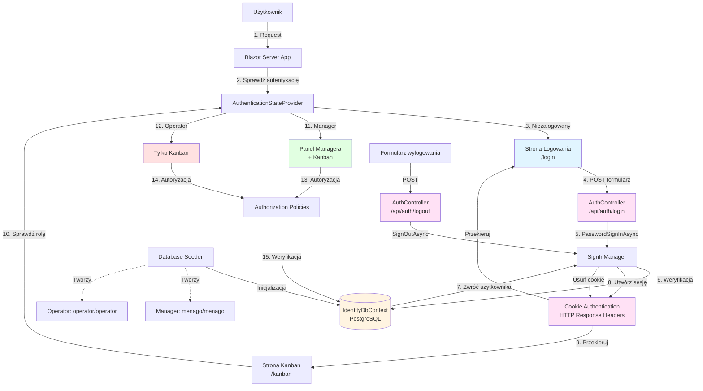

# Podsumowanie sesji planowania PRD - KanbanLite MVP

## Decyzje podjęte podczas planowania

1. **Zakres produktu (MVP):** System do zarządzania produkcją kartek świątecznych w 5 etapach: Projektowanie → Druk → Cięcie → Pakowanie → Wysyłka.

2. **Role i uprawnienia:** Dwie role: **Manager** i **Operator**. Tylko Manager ma dostęp do **Panelu Managera** i może wykonać akcję **"Wyślij do klienta"**.

3. **Widoki aplikacji:** Dwie zakładki: **Kanban** oraz **Panel Managera** (tylko dla Managera).

4. **UI główne (Kanban):** Prosty widok listy/tabeli batchy, z lookupami/dropdownami do wyboru **statusu** i **etapu**. Batch pokazuje: numer zlecenia, numer batcha, liczbę sztuk, progress bar oraz link do projektu.

5. **Statusy batchy:** 3 statusy: **New**, **InProgress**, **Done**.

6. **Limit produkcyjny:** Limit **20 dotyczy wyłącznie liczby batchy w statusie InProgress** (soft limit).

7. **Komunikat ostrzegawczy:** Gdy przekroczymy/przekroczymy potencjalnie limit InProgress: **tylko komunikat + ikona**, bez blokowania działania.

8. **Zmiana etapu batcha:** Zmiana tylko "do przodu" po enumie etapów (bez potwierdzania ilości).

9. **Alerty o opóźnieniach:** Nie implementujemy mechanizmu alertów o opóźnieniach w MVP.

10. **Konfiguracja podziału na batche:** W Panelu Managera edytowalna tabela reguł: "ilość sztuk w zleceniu → % wielkości batcha" (np. 200 szt. → 30% → batch 60 szt.).

11. **Formaty produktów:** Format wybierany przy tworzeniu zlecenia; osobna tabela formatów (CRUD w Panelu Managera). Domyślnie 3 formaty: **A6 (10x15 cm)**, **Kwadrat (15x15 cm)**, **A5 (14.8x21 cm)**.

12. **Wysyłka i archiwum:** "Wyślij do klienta" dostępne dopiero, gdy wszystkie batche spełniają warunki zakończenia (w PRD: etap Wysyłka + status Done). Po wysyłce projekt trafia do historii, a na tablicy zostają tylko projekty niewysłane (technicznie: `Project.IsCompleted = true`, opcjonalnie z `CompletedAt/CompletedBy`).

13. **Historia zmian:** Logujemy historię zmian batchy (kto/kiedy + zmiany etapu/statusu).

14. **Użytkownicy startowi:** Bez self-registration; tworzymy skrypt seedujący 2 konta: Manager (menago/menago) i operator (operator/operator).

15. **Technologia:** @tech-stack.md

16. **Skalowanie MVP:** Maksymalnie 20 batchy **InProgress** jednocześnie (kontrola przez soft limit + monitoring).

17. **Harmonogram:** Fazowanie prac jak zaproponowano: Phase 1 (2–3 tyg), Phase 2 (1–2 tyg), Phase 3 (1 tyg) = 4–6 tyg.

---

## Dopasowane rekomendacje

1. **RBAC (Manager/Operator):** Różne uprawnienia i osobny Panel Managera.

2. **Prosty UI listy batchy:** Minimalny widok listy z filtrami, dropdownami i progress barem.

3. **Wyliczanie progress:** Proste mapowanie etapu na procent (20/40/60/80/100).

4. **Widok projektu + gating wysyłki:** Widok szczegółowy projektu z warunkowym odblokowaniem "Wyślij do klienta".

5. **Audyt zmian:** Historia zmian batchy (kto/kiedy/co) już w MVP.

6. **Konfiguracja podziału na batche w UI:** Edytowalna tabela reguł w Panelu Managera.

7. **Formaty produktów jako dane (CRUD):** Nie hardcode — tabela w DB i UI do zarządzania.

8. **Brak rejestracji użytkowników:** Konta seedowane skryptem dla bezpieczeństwa i prostoty.

9. **Dashboard w Panelu Managera:** Statystyki operacyjne zgodnie z rekomendacją.

10. **Soft limit i monitoring:** Zamiast blokad — ostrzeżenia + widoczny licznik (szczególnie dla InProgress).

11. **Blazor Server + MudBlazor:** Szybkie MVP bez REST API; opcjonalnie SignalR.

---

## Szczegółowe podsumowanie planowania PRD

### a) Główne wymagania funkcjonalne produktu

#### Autentykacja i role
- **Logowanie:** Włączone (`enabled="true"`). Użytkownicy po uruchomieniu aplikacji zawsze trafiają na ekran logowania. Widoki dostępne są wyłącznie po poprawnej autoryzacji.
- **Rejestracja:** Wyłączona (`enabled="false"`). Brak self-registration; konta tworzone przez skrypt seedujący.
- **Role:** Dwie role: **Manager** i **Operator**. Każda rola ma pełnić inne funkcje określone w PRD.
- **Wymuszona autentykacja:** `forced-authentication="true"`. Użytkownicy niezalogowani nie mają dostępu do żadnych stron aplikacji poza logowaniem.
- **Przekierowanie po logowaniu:** Domyślnie na stronę główną (`/`), która przekierowuje do Kanban.
- **Dostęp do widoków:**
  - Manager widzi: Kanban + Panel Managera; może wykonać akcję "Wyślij do klienta".
  - Operator widzi: tylko Kanban.
- **Dostęp gości:** Zablokowany (`guests denied="true"`).

#### Zlecenia/projekty
- Formularz utworzenia zlecenia: liczba sztuk, format produktu (lookup), termin realizacji (walidacje: 1–100000, termin ≥ dziś+7 dni).
- Automatyczny podział zlecenia na batche na podstawie tabeli konfiguracyjnej (%).

#### Batche
- Każdy batch ma: numer (zlecenie.batch), ilość sztuk, **status (New/InProgress/Done)**, etap produkcji (5 etapów), progress bar.
- Zmiana etapu: tylko do przodu.
- Zmiana statusu: obsługa New/InProgress/Done (InProgress wlicza się do limitu).

#### Limit 20 InProgress
- Limit dotyczy **tylko batchy w statusie InProgress** (globalnie).
- Po przekroczeniu: komunikat ostrzegawczy + ikona, bez blokady.

#### Wysyłka
- "Wyślij do klienta" tylko dla Managera i tylko, gdy wszystkie batche spełniają warunek zakończenia (etap Wysyłka + status Done).
- Po wysyłce: projekt przeniesiony do historii; na tablicy tylko niewysłane projekty.

#### Panel Managera
- Dashboard metryk (zgodnie z rekomendacją).
- Konfiguracja batchy (edytowalna tabela progów i %).
- Formaty produktów (CRUD).
- Historia zleceń (archiwum + podgląd szczegółów).

#### Audyt
- Historia zmian statusów/etapów batchy (user, timestamp, zmiana).

---

### b) Kluczowe historie użytkownika i ścieżki korzystania

#### US-001: Logowanie
**Jako** użytkownik  
**Chcę** zalogować się do systemu  
**Aby** korzystać z funkcji odpowiednich dla mojej roli

**Kryteria akceptacji:**
- Poprawne logowanie
- Przekierowanie do Kanban
- Widoczna rola użytkownika

---

#### US-002: Utworzenie zlecenia (Manager)
**Jako** Manager  
**Chcę** utworzyć zlecenie (ilość, format, termin)  
**Aby** rozpocząć produkcję

**Kryteria akceptacji:**
- Walidacje pól (liczba sztuk 1-100000, termin ≥ dziś+7 dni)
- Automatyczne utworzenie batchy wg tabeli konfiguracyjnej
- Wszystkie batchy startują jako New

---

#### US-003: Start batcha (Operator/Manager)
**Jako** Operator  
**Chcę** zmienić status batcha z New na InProgress  
**Aby** rozpocząć pracę nad batchem

**Kryteria akceptacji:**
- Status zmieniony na InProgress
- Licznik InProgress aktualizuje się automatycznie
- Ostrzeżenie wyświetla się gdy InProgress > 20

---

#### US-004: Przesunięcie etapu batcha (Operator/Manager)
**Jako** Operator  
**Chcę** przesunąć batch do kolejnego etapu  
**Aby** odzwierciedlić postęp pracy

**Kryteria akceptacji:**
- Zmiana etapu tylko do przodu
- Progress bar aktualizuje się automatycznie
- Wpis w historii zmian

---

#### US-005: Zakończenie batcha (Operator/Manager)
**Jako** Operator  
**Chcę** zmienić status batcha z InProgress na Done  
**Aby** zakończyć pracę nad batchem

**Kryteria akceptacji:**
- Status zmieniony na Done
- Licznik InProgress zmniejszony
- Historia zmian zapisana

---

#### US-006: Podgląd projektu (Operator/Manager)
**Jako** użytkownik  
**Chcę** wejść w szczegóły projektu  
**Aby** zobaczyć wszystkie batche i statystyki

**Kryteria akceptacji:**
- Widoczne wszystkie batche zlecenia
- Progres projektu (średnia wszystkich batchy)
- Status gotowości do wysyłki
- Dla Managera: akcje administracyjne (edycja terminu, wysyłka)

---

#### US-007: Wysyłka do klienta (Manager)
**Jako** Manager  
**Chcę** wysłać zlecenie do klienta  
**Aby** zamknąć projekt

**Kryteria akceptacji:**
- Przycisk aktywny tylko gdy wszystkie batche: etap Wysyłka + status Done
- Dialog potwierdzenia przed wysyłką
- Przeniesienie do historii zleceń
- Zniknięcie z listy aktywnych batchy

---

#### US-008: Konfiguracja reguł batchowania (Manager)
**Jako** Manager  
**Chcę** edytować progi i % batchy  
**Aby** dopasować produkcję do potrzeb

**Kryteria akceptacji:**
- Edycja tabeli reguł (zakresy ilości → %)
- Walidacja zakresów (nie mogą się nakładać)
- Wpływ tylko na nowe zlecenia

---

#### US-009: Zarządzanie formatami (Manager)
**Jako** Manager  
**Chcę** dodawać/edytować formaty  
**Aby** były dostępne przy tworzeniu zlecenia

**Kryteria akceptacji:**
- CRUD formatów produktów
- Domyślne 3 formaty obecne w systemie
- Formaty widoczne w dropdownie przy tworzeniu zlecenia

---

#### US-010: Dashboard (Manager)
**Jako** Manager  
**Chcę** widzieć metryki produkcji  
**Aby** zarządzać obciążeniem

**Kryteria akceptacji:**
- Rozkład batchy po statusach (New/InProgress/Done)
- Rozkład batchy po etapach produkcji
- Lista pilnych zleceń (termin < 7 dni)
- Średni czas realizacji zlecenia

---

### c) Kryteria sukcesu i pomiar

- **Automatyczne batchowanie:** Utworzenie zlecenia 10k → auto-batche wg konfiguracji
- **Widoczność i kontrola:** Operator aktualizuje status/etap batcha z listy; progress spójny
- **Gating wysyłki:** Brak możliwości wysyłki, dopóki nie spełnione warunki batchy
- **Kontrola obciążenia:** Licznik InProgress działa; ostrzeżenie przy przekroczeniu 20
- **Sprawność operacyjna:** Czas utworzenia zlecenia < 2 min, mniejsza liczba błędów w śledzeniu

---

## Plan architektury systemu uwierzytelniania

### Przegląd architektury

System uwierzytelniania w KanbanLite MVP opiera się na **ASP.NET Core Identity** zintegrowanym z **Blazor Server**. Architektura zapewnia wymuszoną autentykację dla wszystkich użytkowników, kontrolę dostępu opartą na rolach (RBAC) oraz prostą konfigurację bez możliwości samodzielnej rejestracji.

### Komponenty systemu

#### 1. **ASP.NET Core Identity**
- **IdentityDbContext:** Kontekst bazy danych zarządzający użytkownikami, rolami i claimami
- **User Store:** Przechowywanie danych użytkowników w SQL Server (tabele: `AspNetUsers`, `AspNetRoles`, `AspNetUserRoles`)
- **Password Hasher:** Bezpieczne hashowanie haseł używając PBKDF2
- **SignInManager:** Zarządzanie sesjami logowania i wylogowania

#### 2. **Blazor Server Authentication**
- **AuthenticationStateProvider:** Dostarczanie informacji o stanie uwierzytelnienia do komponentów Blazor
- **AuthorizeView:** Komponenty warunkowo renderowane na podstawie roli/autentykacji
- **[Authorize] attribute:** Ochrona routingu i stron przed nieautoryzowanym dostępem
- **CascadingAuthenticationState:** Propagacja stanu uwierzytelnienia w hierarchii komponentów

#### 3. **Role-Based Access Control (RBAC)**
- **Role:** Manager, Operator
- **Policy-based authorization:** Polityki dostępu definiowane w `Program.cs` lub `Startup.cs`
- **Role checks:** Weryfikacja roli w komponentach i kontrolerach

#### 4. **Konfiguracja routingu i przekierowań**
- **Login Page:** `/login` - jedyna publicznie dostępna strona
- **Default Route:** `/` - sprawdza autoryzację: niezalogowany → `/login`, zalogowany → `/kanban`
- **Unauthorized Redirect:** Automatyczne przekierowanie do `/login` dla niezalogowanych
- **Forced Authentication:** Wszystkie strony wymagają autentykacji (oprócz logowania i strony głównej `/`)

#### 5. **Seedowanie danych**
- **Database Seeder:** Skrypt inicjalizujący domyślnych użytkowników:
  - Manager: `menago/menago`
  - Operator: `operator/operator`
- **Role Seeder:** Automatyczne tworzenie ról przy pierwszym uruchomieniu
- **Migration Strategy:** Seedowanie w metodzie `OnModelCreating` lub dedykowanym middleware

### Architektura Cookie Bridge

System uwierzytelniania wykorzystuje wzorzec **Cookie Bridge** - kontroler HTTP, który obsługuje tradycyjne żądania POST do logowania i wylogowania. Jest to konieczne, ponieważ Blazor Server działa w trybie `InteractiveServer` z SignalR, który nie pozwala na bezpośrednie ustawianie ciasteczek autentykacji z poziomu połączenia WebSocket.

#### Dlaczego Cookie Bridge?

- **Ograniczenia SignalR/WebSocket:** Połączenia SignalR nie obsługują pełnego zestawu nagłówków HTTP wymaganych do ustawienia ciasteczek autentykacji (Set-Cookie).
- **Wymagania ASP.NET Core Identity:** `SignInManager.PasswordSignInAsync` wymaga tradycyjnego kontekstu HTTP z pełnym dostępem do nagłówków odpowiedzi.
- **Rozwiązanie:** Kontroler `AuthController` działa jako "most" między formularzem HTML a mechanizmem uwierzytelniania Identity, umożliwiając poprawne ustawienie ciasteczek.

#### Komponenty Cookie Bridge

1. **AuthController** (`/api/auth/login`, `/api/auth/logout`):
   - Obsługuje żądania POST z formularzy HTML
   - Używa `SignInManager.PasswordSignInAsync` do uwierzytelniania
   - Ustawia ciasteczka autentykacji przez standardowy kontekst HTTP
   - Wykonuje przekierowania po sukcesie/porażce

2. **Formularz logowania** (`Login.razor`):
   - Standardowy HTML `<form>` z `action="api/auth/login"` i `method="post"`
   - Komponenty MudBlazor z atrybutem `Name` dla model bindingu
   - Obsługa parametru query string `error` do wyświetlania komunikatów błędów

3. **Formularz wylogowania** (`NavMenu.razor`):
   - Formularz POST do `api/auth/logout`
   - Przycisk MudBlazor z `ButtonType.Submit`

### Przepływ uwierzytelniania

1. **Użytkownik odwiedza aplikację** → Ładuje się strona główna `/` (Index.razor)
2. **Index sprawdza autoryzację** → Jeśli niezalogowany → przekierowanie do `/login`, jeśli zalogowany → przekierowanie do `/kanban`
3. **Wprowadza dane logowania** → Formularz HTML wysyła POST do `/api/auth/login`
4. **AuthController** → Wywołuje `SignInManager.PasswordSignInAsync` z danymi z formularza
5. **Weryfikacja hasła** → Porównanie z zahashowanym hasłem w bazie przez Identity
6. **Tworzenie sesji** → Ustawienie cookie autentykacji (ASP.NET Core Identity Cookie) przez standardowy kontekst HTTP
7. **Przekierowanie** → Do `/kanban` (sukces) lub `/login?error=true` (porażka)
8. **Autoryzacja w komponentach** → Sprawdzenie roli użytkownika przez `AuthenticationStateProvider`
9. **Renderowanie UI** → Warunkowe wyświetlanie elementów na podstawie roli

### Bezpieczeństwo

- **Wymuszona autentykacja:** Wszystkie endpointy chronione atrybutem `[Authorize]`
- **Brak self-registration:** Rejestracja wyłączona w konfiguracji Identity
- **Secure Cookies:** Cookies autentykacji z flagami `HttpOnly`, `Secure`, `SameSite`
- **Password Requirements:** Minimalne wymagania dla haseł (długość, złożoność)
- **Session Management:** Automatyczne wylogowanie po wygaśnięciu sesji
- **Antiforgery Protection:** Middleware `UseAntiforgery()` włączony przed uwierzytelnianiem dla ochrony przed atakami CSRF
- **Cookie Bridge Security:** Kontroler `AuthController` używa `[AllowAnonymous]` dla akcji logowania, `[Authorize]` dla wylogowania

### Diagram architektury



### Implementacja techniczna

#### Konfiguracja w Program.cs

```csharp
// Dodanie Identity
builder.Services.AddIdentity<ApplicationUser, IdentityRole>(options => {
    options.Password.RequiredLength = 1;
    options.Password.RequireDigit = false;
    options.SignIn.RequireConfirmedAccount = false;
})
.AddEntityFrameworkStores<AppDbContext>()
.AddDefaultTokenProviders();

// Konfiguracja cookie authentication
builder.Services.ConfigureApplicationCookie(options => {
    options.LoginPath = "/login";
    options.AccessDeniedPath = "/login";
    options.ExpireTimeSpan = TimeSpan.FromHours(8);
    options.SlidingExpiration = true;
});

// Dodanie obsługi kontrolerów dla Cookie Bridge
builder.Services.AddControllers();

// Polityki autoryzacji
builder.Services.AddAuthorization();

// Middleware pipeline
app.UseRouting();
app.UseAntiforgery(); // Przed uwierzytelnianiem dla ochrony CSRF
app.UseAuthentication();
app.UseAuthorization();
app.MapControllers(); // Mapowanie AuthController
app.MapRazorComponents<App>()
    .AddInteractiveServerRenderMode();
```

#### Kluczowe punkty końcowe

- **POST /api/auth/login**: Akcja logowania w `AuthController`
  - Przyjmuje `username` i `password` jako `[FromForm]`
  - Używa `SignInManager.PasswordSignInAsync` z `isPersistent: true`
  - Przekierowuje do `/kanban` (sukces) lub `/login?error=true` (porażka)
  - Oznaczona `[AllowAnonymous]`

- **POST /api/auth/logout**: Akcja wylogowania w `AuthController`
  - Wywołuje `SignInManager.SignOutAsync`
  - Przekierowuje do `/login`
  - Oznaczona `[Authorize]` (wymaga zalogowania)

#### Seedowanie użytkowników

```csharp
// W metodzie OnModelCreating lub dedykowanym seederze
if (!context.Roles.Any()) {
    context.Roles.Add(new IdentityRole { Name = "Manager" });
    context.Roles.Add(new IdentityRole { Name = "Operator" });
    context.SaveChanges();
}

if (!context.Users.Any()) {
    var manager = new IdentityUser { UserName = "menago" };
    var operator = new IdentityUser { UserName = "operator" };
    // Hashowanie haseł i przypisanie ról
}
```

### Integracja z Blazor

- **CascadingAuthenticationState:** W `App.razor` lub głównym layout
- **AuthorizeView:** W komponentach wymagających autoryzacji
- **NavigationManager:** Przekierowania po logowaniu/wylogowaniu
- **AuthenticationState:** Dostęp do informacji o użytkowniku w komponentach
- **Render Mode:** `InteractiveServerRenderMode(prerender: false)` - wyłączony prerendering dla poprawnego działania SignalR
- **Formularze HTML:** Standardowe formularze POST zamiast `EditForm` w komponentach logowania/wylogowania (wymagane dla Cookie Bridge)

---
---

**Dokument przygotowany:** 12 stycznia 2026  
**Status:** Gotowy do implementacji
